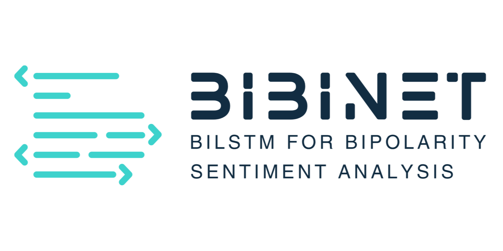
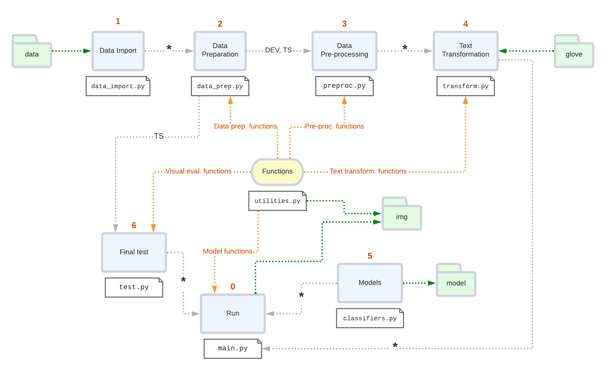

<p align="center">
    
</p>

# BiBiNET: BiLSTM for bipolarity sentiment analysis.
_A Gated Recurrent Neural Network for Supervised Text
Classification: detecting hate speech from different online
textual genres._

<a href="https://github.com/dilettagoglia/BiBiNET/blob/main/LICENSE"></a>
<a href="https://github.com/dilettagoglia/BiBiNET/stargazers"></a>
<a href="https://github.com/dilettagoglia/BiBiNET/network/members"></a>

## Description
This project was developed for the ”Human Language Technologies” course of Professor Giuseppe Attardi.

## Directory structure (main elements)
```
BiBiNET
  │── src
  │    │── data_import.py                   # process 1/6
  │    │── data_prep.py                     # process 2/6                     
  │    │── preproc.py                       # process 3/6
  │    │── transform.py                     # process 4/6
  │    │── classifiers.py                   # process 5/6
  │    │── test.py                          # process 6/6
  │    │── utilities.py
  │    └── main.py                          # file to run
  └── data
  │    └── forum_data
  │    │   │── all_files.csv                # text
  │    │   └── annotations_metadata.csv     # labels
  │    └── twitter_1
  │    │   └── twitter_dataset.csv       
  │    └── twitter_2
  │    │    │── train.csv                
  │    │    └── test.csv     
  │    └── wikipedia_data
  │         │── train.csv                
  │         └── test.csv    
  └── glove
  │   │── glove.twitter.27B.100d      
  │   └── glove.twitter.27B.200d        
  └── model          
  │   └── model.h5                          # final model   
  └── requirements.txt
  └── report.pdf                            # project guide
  └── README.md
  └── LICENSE  
```
<p align="center">
    
</p>

## Quick start
Install Python:<br>
`sudo apt install python3`

Install pip:<br>
`sudo apt install --upgrade python3-pip`

Install requirements:<br>
`python -m pip install --requirement requirements.txt`

Execute [main](src/main.py)
```
cd src/
python main.py
```

## Corresponding author
**Dr. Diletta Goglia** <a href="https://orcid.org/0000-0002-2622-7495"></a> <br/>
**Postgraduate Student in MSc in Artificial Intelligence** <br/>
**Computer Science department, University of Pisa, Italy** <br/>
[d.goglia@studenti.unipi.it](mailto:d.goglia@studenti.unipi.it) <br/>
[dilettagoglia.netlify.app](http://www.dilettagoglia.netlify.app) 